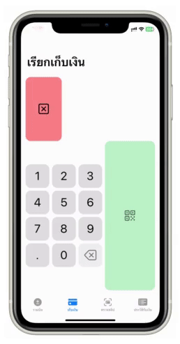
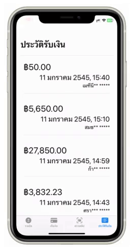

# ThaiQR_POS (Ongoing Project) 
A Point-of-Sale iOS app for in-person Thailand PropmtPay ([Thai-QR30](https://www.bot.or.th/Thai/PaymentSystems/StandardPS/Documents/ThaiQRCode_Payment_Standard.pdf)) merchants.

## Feature
- Verifying costumer payment slip ([MiniQR](https://developer.scb/assets/documents/documentation/qr-payment/extracting-data-from-mini-qr.pdf))

- Generating Merchant-Presented QR code generation (EMV® QR Code)

- Transaction Lookup

Progress: UI Completed, QR Code Scanning fuction
Todo: Connect to the web services, [SCB_API](https://developer.scb/#/home)
